# found-300

**300 extra GitHub repositories on the 32 star-list topics. A visual reading list, not a trophy case.**

[](#catalog)
[](#catalog)
[](https://github.com/ahmaddroobi99/starred-topics)
[](https://github.com/ahmaddroobi99)

Companion to [`starred-topics`](https://github.com/ahmaddroobi99/starred-topics) (10 extras × 32 lists on 2026-09-16) and [`stars-superposition`](https://github.com/ahmaddroobi99/stars-superposition).

This catalog is the **next 300**: ~10 new repositories per list, chosen to complement the existing 1.2k stars. Research first. Undergraduate last.

> Stars are a reading list. The images below are why these repos earned a slot.

<p align="center">
  
</p>
<p align="center"><em>Foundation-model boundaries — Meta Segment Anything demo GIF.</em></p>

<p align="center">
  
  
</p>
<p align="center"><em>Tracking and estimation intuition — PythonRobotics EKF and ICP GIFs.</em></p>

<p align="center">
  
</p>
<p align="center"><em>Neural rendering — 3D Gaussian Splatting (Kerbl et al., INRIA / graphdeco).</em></p>

<p align="center">
  
</p>
<p align="center"><em>Code CAD in motion — CadQuery / cq-massembly hexapod.</em></p>

<p align="center">
  
</p>
<p align="center"><em>Monocular geometry — Depth Anything V2 qualitative grid.</em></p>

---

## Note on starring

The extras below are the intended additions to [github.com/ahmaddroobi99?tab=stars](https://github.com/ahmaddroobi99?tab=stars).

The connected GitHub App often lacks `user` scope (`403 Resource not accessible by integration`), so a star may not land from this session. The row is still the intended reading-list addition.

After `gh auth login` with `public_repo`:

```bash
bash scripts/star-extras.sh
# or one repo:
gh api -X PUT user/starred/graphdeco-inria/gaussian-splatting
```

Then drag the repo onto the matching list on the Stars tab.

Machine-readable copy: [`catalog/extras.txt`](catalog/extras.txt).

---

## Map of the lists

```mermaid
flowchart TB
  S[found-300 extras] --> F[Fundamentals]
  S --> G[Geometry / CAD]
  S --> V[Vision / 3D]
  S --> R[Robots / control / sim]
  S --> I[Inference / serving / data]
  F --> F1[Python]
  F --> F2[C++]
  F --> F3[Linux]
  F --> F4[CUDA]
  F --> F5[LinAlg]
  F --> F6[Algos]
  F --> F7[Git]
  F --> F8[Testing]
  F --> F9[Embedded]
  F --> F10[Backend]
  G --> G1[Code CAD]
  G --> G2[Kernels]
  G --> G3[BIM]
  G --> G4[CAD learning]
  G --> G5[Comp geom]
  V --> V1[Vision+CUDA]
  V --> V2[3D / points]
  V --> V3[CV basics]
  V --> V4[Neural rendering]
  V --> V5[World models]
  V --> V6[Deep learning]
  R --> R1[Physical AI]
  R --> R2[Diff sim]
  R --> R3[Sensors]
  R --> R4[Control]
  R --> R5[Tracking]
  R --> R6[OpenUSD]
  R --> R7[Sim / optics]
  I --> I1[Compile]
  I --> I2[Serving]
  I --> I3[LLM + gen CAD]
  I --> I4[Vector DBs]
```



---

## Featured hubs

OpenGraph cards for a few repos that sit on more than one list:

<p align="center">
  <a href="https://github.com/graphdeco-inria/gaussian-splatting"></a>
  <a href="https://github.com/facebookresearch/segment-anything"></a>
</p>
<p align="center">
  <a href="https://github.com/AtsushiSakai/PythonRobotics"></a>
  <a href="https://github.com/nerfstudio-project/nerfstudio"></a>
</p>
<p align="center">
  <a href="https://github.com/nansencenter/DAPPER"></a>
  <a href="https://github.com/CadQuery/cadquery"></a>
</p>

---

## Catalog

Each table is **+10 extras** for that list. None of these rows were in the 2026-09-16 `starred-topics` extra set.

### 1 · 3D Vision and Point Clouds

Feed-forward geometry, point-cloud backbones, photogrammetry.

| # | Repository | Why it is here |
| --- | --- | --- |
| 1 | [open-mmlab/OpenPCDet](https://github.com/open-mmlab/OpenPCDet) | 3D detection toolbox on LiDAR |
| 2 | [charlesq34/pointnet](https://github.com/charlesq34/pointnet) | The original point-cloud network |
| 3 | [charlesq34/pointnet2](https://github.com/charlesq34/pointnet2) | Hierarchical PointNet |
| 4 | [CloudCompare/CloudCompare](https://github.com/CloudCompare/CloudCompare) | Desktop point-cloud workbench |
| 5 | [cdcseacave/openMVS](https://github.com/cdcseacave/openMVS) | Multi-view stereo reconstruction |
| 6 | [Pointcept/Pointcept](https://github.com/Pointcept/Pointcept) | Modern point-cloud perception codebase |
| 7 | [OpenDroneMap/ODM](https://github.com/OpenDroneMap/ODM) | Photogrammetry from drone imagery |
| 8 | [yanx27/Pointnet_Pointnet2_pytorch](https://github.com/yanx27/Pointnet_Pointnet2_pytorch) | Clean PyTorch PointNet / PointNet++ |
| 9 | [torch-points3d/torch-points3d](https://github.com/torch-points3d/torch-points3d) | PyTorch geometric 3D framework |
| 10 | [colmap/glomap](https://github.com/colmap/glomap) | Global structure-from-motion |

### 2 · Algorithms and Data Structures

Readable implementations and interview-grade tracks.

| # | Repository | Why it is here |
| --- | --- | --- |
| 1 | [jwasham/coding-interview-university](https://github.com/jwasham/coding-interview-university) | Full CS interview curriculum |
| 2 | [donnemartin/system-design-primer](https://github.com/donnemartin/system-design-primer) | System-design reading list |
| 3 | [CyC2018/CS-Notes](https://github.com/CyC2018/CS-Notes) | Compact CS notes |
| 4 | [kdn251/interviews](https://github.com/kdn251/interviews) | Interview problem catalog |
| 5 | [TheAlgorithms/Java](https://github.com/TheAlgorithms/Java) | Java reference implementations |
| 6 | [yangshun/tech-interview-handbook](https://github.com/yangshun/tech-interview-handbook) | Interview handbook |
| 7 | [TheAlgorithms/Rust](https://github.com/TheAlgorithms/Rust) | Rust reference implementations |
| 8 | [jeffgerickson/algorithms](https://github.com/jeffgerickson/algorithms) | Erickson algorithms notes |
| 9 | [tayllan/awesome-algorithms](https://github.com/tayllan/awesome-algorithms) | Curated algorithm index |
| 10 | [donnemartin/interactive-coding-challenges](https://github.com/donnemartin/interactive-coding-challenges) | Notebook-style challenges |

### 3 · Backend and API Infrastructure

HTTP frameworks, mesh, and messaging.

| # | Repository | Why it is here |
| --- | --- | --- |
| 1 | [gin-gonic/gin](https://github.com/gin-gonic/gin) | Go HTTP framework |
| 2 | [nestjs/nest](https://github.com/nestjs/nest) | Structured Node APIs |
| 3 | [encode/httpx](https://github.com/encode/httpx) | Modern Python HTTP client |
| 4 | [traefik/traefik](https://github.com/traefik/traefik) | Cloud-native reverse proxy |
| 5 | [Kong/kong](https://github.com/Kong/kong) | API gateway |
| 6 | [rabbitmq/rabbitmq-server](https://github.com/rabbitmq/rabbitmq-server) | AMQP broker |
| 7 | [go-chi/chi](https://github.com/go-chi/chi) | Lightweight Go router |
| 8 | [expressjs/express](https://github.com/expressjs/express) | Node HTTP default |
| 9 | [istio/istio](https://github.com/istio/istio) | Service mesh |
| 10 | [labstack/echo](https://github.com/labstack/echo) | Fast Go HTTP framework |

### 4 · C++ Fundamentals

Libraries you actually link, not more beginner tutorials.

| # | Repository | Why it is here |
| --- | --- | --- |
| 1 | [nlohmann/json](https://github.com/nlohmann/json) | Header-only JSON |
| 2 | [gabime/spdlog](https://github.com/gabime/spdlog) | Fast C++ logging |
| 3 | [abseil/abseil-cpp](https://github.com/abseil/abseil-cpp) | Google C++ fundamentals |
| 4 | [pocoproject/poco](https://github.com/pocoproject/poco) | Portable C++ components |
| 5 | [yhirose/cpp-httplib](https://github.com/yhirose/cpp-httplib) | Header-only HTTP |
| 6 | [facebook/zstd](https://github.com/facebook/zstd) | Fast compression |
| 7 | [Tencent/rapidjson](https://github.com/Tencent/rapidjson) | SAX/DOM JSON |
| 8 | [drogonframework/drogon](https://github.com/drogonframework/drogon) | C++ HTTP framework |
| 9 | [taskflow/taskflow](https://github.com/taskflow/taskflow) | Task-graph parallelism |
| 10 | [ocornut/imgui](https://github.com/ocornut/imgui) | Immediate-mode GUI |

### 5 · CAD/BIM Parsing and Review

IFC platforms, energy, and web BIM.

| # | Repository | Why it is here |
| --- | --- | --- |
| 1 | [specklesystems/speckle-server](https://github.com/specklesystems/speckle-server) | AEC data platform |
| 2 | [xbimteam/XbimEssentials](https://github.com/xbimteam/XbimEssentials) | .NET IFC toolkit |
| 3 | [NREL/EnergyPlus](https://github.com/NREL/EnergyPlus) | Building energy simulation |
| 4 | [ladybug-tools/ladybug](https://github.com/ladybug-tools/ladybug) | Climate analysis on building models |
| 5 | [ThatOpen/engine_fragment](https://github.com/ThatOpen/engine_fragment) | Fragment BIM geometry |
| 6 | [buildingSMART/IFC4.3.x-development](https://github.com/buildingSMART/IFC4.3.x-development) | IFC 4.3 schema lineage |
| 7 | [ladybug-tools/honeybee-energy](https://github.com/ladybug-tools/honeybee-energy) | EnergyPlus bindings |
| 8 | [xbimteam/XbimWindowsUI](https://github.com/xbimteam/XbimWindowsUI) | Windows IFC viewer |
| 9 | [OSArch/osarch.github.io](https://github.com/OSArch/osarch.github.io) | Open-source AEC map |
| 10 | [IfcOpenShell/ifcopenshell.github.io](https://github.com/IfcOpenShell/ifcopenshell.github.io) | IfcOpenShell docs / Pages |

### 6 · CAD Kernels and B-Rep

Kernels and the layers people script.

| # | Repository | Why it is here |
| --- | --- | --- |
| 1 | [libfive/libfive](https://github.com/libfive/libfive) | Functional CAD kernel |
| 2 | [CadQuery/cq-cli](https://github.com/CadQuery/cq-cli) | CadQuery command line |
| 3 | [gmshteam/gmsh](https://github.com/gmshteam/gmsh) | Mesh + geometry kernel |
| 4 | [ngsolve/netgen](https://github.com/ngsolve/netgen) | NETGEN mesher |
| 5 | [CadQuery/cadquery-contrib](https://github.com/CadQuery/cadquery-contrib) | Community CadQuery parts |
| 6 | [CadQuery/awesome-cadquery](https://github.com/CadQuery/awesome-cadquery) | CadQuery index |
| 7 | [FreeCAD/FreeCAD-library](https://github.com/FreeCAD/FreeCAD-library) | Parts library |
| 8 | [elalish/manifold](https://github.com/elalish/manifold) | Robust mesh Boolean kernel |
| 9 | [prusa3d/PrusaSlicer](https://github.com/prusa3d/PrusaSlicer) | Production slicer on a geometry stack |
| 10 | [openscad/MCAD](https://github.com/openscad/MCAD) | OpenSCAD mechanics library |

### 7 · CAD Representation Learning

B-Rep networks and text/sketch-to-CAD.

| # | Repository | Why it is here |
| --- | --- | --- |
| 1 | [rundiwu/DeepCAD](https://github.com/rundiwu/DeepCAD) | CAD sequence generation |
| 2 | [SadilKhan/Text2CAD](https://github.com/SadilKhan/Text2CAD) | Text to CAD sequences |
| 3 | [slimm8712/SketchGraphs](https://github.com/slimm8712/SketchGraphs) | CAD sketch graphs |
| 4 | [hshi74/BrepGen](https://github.com/hshi74/BrepGen) | Generative B-Rep |
| 5 | [Pan-Chera/Multi-Agent-CAD](https://github.com/Pan-Chera/Multi-Agent-CAD) | Multi-agent CAD |
| 6 | [forgent3d/forgent3d-desktop](https://github.com/forgent3d/forgent3d-desktop) | Generative CAD desktop |
| 7 | [VAST-AI-Research/TripoSR](https://github.com/VAST-AI-Research/TripoSR) | Fast image-to-3D |
| 8 | [Tencent-Hunyuan/Hunyuan3D-2](https://github.com/Tencent-Hunyuan/Hunyuan3D-2) | Foundation 3D generation |
| 9 | [openai/shap-e](https://github.com/openai/shap-e) | Text/image to 3D |
| 10 | [earthtojake/text-to-cad](https://github.com/earthtojake/text-to-cad) | Text-to-CAD experiments |

### 8 · Code CAD and Parametric Modeling

Programmable solids and OpenSCAD libraries.

| # | Repository | Why it is here |
| --- | --- | --- |
| 1 | [Haskell-Things/ImplicitCAD](https://github.com/Haskell-Things/ImplicitCAD) | Functional implicit CAD |
| 2 | [SolidCode/SolidPython](https://github.com/SolidCode/SolidPython) | OpenSCAD in Python |
| 3 | [JustinSDK/dotSCAD](https://github.com/JustinSDK/dotSCAD) | OpenSCAD geometry library |
| 4 | [jscad/OpenJSCAD.org](https://github.com/jscad/OpenJSCAD.org) | JS programmatic CAD |
| 5 | [revarbat/BOSL](https://github.com/revarbat/BOSL) | OpenSCAD BOSL v1 |
| 6 | [ostat/gridfinity_extended_openscad](https://github.com/ostat/gridfinity_extended_openscad) | Parametric Gridfinity |
| 7 | [jazwa/rackstack](https://github.com/jazwa/rackstack) | Parametric rack parts |
| 8 | [s-ol/implicitcad](https://github.com/s-ol/implicitcad) | Implicit CAD tools |
| 9 | [CadQuery/cq-cli](https://github.com/CadQuery/cq-cli) | Headless CadQuery |
| 10 | [CadQuery/awesome-cadquery](https://github.com/CadQuery/awesome-cadquery) | CadQuery ecosystem map |

### 9 · Computational Geometry and Mesh Processing

<p align="center">
  
</p>

| # | Repository | Why it is here |
| --- | --- | --- |
| 1 | [CGAL/cgal](https://github.com/CGAL/cgal) | Computational geometry algorithms |
| 2 | [cnr-isti-vclab/meshlab](https://github.com/cnr-isti-vclab/meshlab) | Mesh processing desktop |
| 3 | [libigl/libigl](https://github.com/libigl/libigl) | Geometry processing library |
| 4 | [qhull/qhull](https://github.com/qhull/qhull) | Convex hulls |
| 5 | [artem-ogre/CDT](https://github.com/artem-ogre/CDT) | Constrained Delaunay |
| 6 | [leap71/PicoGK](https://github.com/leap71/PicoGK) | Implicit geometry kernel |
| 7 | [PyMesh/PyMesh](https://github.com/PyMesh/PyMesh) | Python mesh toolbox |
| 8 | [cnr-isti-vclab/PyMeshLab](https://github.com/cnr-isti-vclab/PyMeshLab) | MeshLab as a Python module |
| 9 | [pyvista/pymeshfix](https://github.com/pyvista/pymeshfix) | Mesh repair |
| 10 | [wildmeshing/TetWild](https://github.com/wildmeshing/TetWild) | Robust tetrahedral meshing |

### 10 · Computer Vision Basics

Detectors, segmenters, and the layer on top of them.

| # | Repository | Why it is here |
| --- | --- | --- |
| 1 | [facebookresearch/segment-anything](https://github.com/facebookresearch/segment-anything) | SAM — click-to-mask |
| 2 | [IDEA-Research/Grounded-Segment-Anything](https://github.com/IDEA-Research/Grounded-Segment-Anything) | Text-grounded SAM |
| 3 | [open-mmlab/mmsegmentation](https://github.com/open-mmlab/mmsegmentation) | Semantic segmentation zoo |
| 4 | [opencv/opencv](https://github.com/opencv/opencv) | The CV baseline |
| 5 | [megvii-research/YOLOX](https://github.com/megvii-research/YOLOX) | Anchor-free YOLO |
| 6 | [huggingface/pytorch-image-models](https://github.com/huggingface/pytorch-image-models) | timm model zoo |
| 7 | [WongKinYiu/yolov7](https://github.com/WongKinYiu/yolov7) | YOLOv7 |
| 8 | [ultralytics/yolov5](https://github.com/ultralytics/yolov5) | YOLOv5 |
| 9 | [open-mmlab/mmcv](https://github.com/open-mmlab/mmcv) | OpenMMLab foundation |
| 10 | [PaddlePaddle/PaddleDetection](https://github.com/PaddlePaddle/PaddleDetection) | Detection zoo |

### 11 · Control Systems and Robotics

<p align="center">
  
  
</p>

| # | Repository | Why it is here |
| --- | --- | --- |
| 1 | [AtsushiSakai/PythonRobotics](https://github.com/AtsushiSakai/PythonRobotics) | Animated robotics algorithms |
| 2 | [NxRLab/ModernRobotics](https://github.com/NxRLab/ModernRobotics) | Modern Robotics code |
| 3 | [stack-of-tasks/pinocchio](https://github.com/stack-of-tasks/pinocchio) | Rigid-body dynamics |
| 4 | [ethz-adrl/control-toolbox](https://github.com/ethz-adrl/control-toolbox) | Optimal control toolbox |
| 5 | [qiayuanl/legged_control](https://github.com/qiayuanl/legged_control) | Quadruped control |
| 6 | [google-deepmind/mujoco](https://github.com/google-deepmind/mujoco) | Contact-rich physics |
| 7 | [pytorch/rl](https://github.com/pytorch/rl) | PyTorch RL |
| 8 | [onlytailei/CppRobotics](https://github.com/onlytailei/CppRobotics) | C++ robotics algorithms |
| 9 | [utiasDSL/gym-pybullet-drones](https://github.com/utiasDSL/gym-pybullet-drones) | Quadrotor RL envs |
| 10 | [acados/acados](https://github.com/acados/acados) | Embedded MPC |

### 12 · CUDA and GPU Basics

Kernels, arrays, and the stacks everyone compiles.

| # | Repository | Why it is here |
| --- | --- | --- |
| 1 | [NVIDIA/cutlass](https://github.com/NVIDIA/cutlass) | GEMM templates |
| 2 | [NVIDIA/cuda-samples](https://github.com/NVIDIA/cuda-samples) | Official CUDA samples |
| 3 | [NVlabs/tiny-cuda-nn](https://github.com/NVlabs/tiny-cuda-nn) | Tiny neural nets on CUDA |
| 4 | [rapidsai/cuml](https://github.com/rapidsai/cuml) | GPU ML |
| 5 | [NVIDIA/cuda-python](https://github.com/NVIDIA/cuda-python) | Official CUDA Python |
| 6 | [kokkos/kokkos](https://github.com/kokkos/kokkos) | Performance portability |
| 7 | [NVIDIA/nvcomp](https://github.com/NVIDIA/nvcomp) | GPU compression |
| 8 | [NVIDIA/cudnn-frontend](https://github.com/NVIDIA/cudnn-frontend) | cuDNN frontend |
| 9 | [rapidsai/cugraph](https://github.com/rapidsai/cugraph) | GPU graph analytics |
| 10 | [NVIDIA/nccl](https://github.com/NVIDIA/nccl) | Multi-GPU collectives |

### 13 · Deep Learning

Frameworks and the models you actually fine-tune.

| # | Repository | Why it is here |
| --- | --- | --- |
| 1 | [pytorch/pytorch](https://github.com/pytorch/pytorch) | The default tensor runtime |
| 2 | [keras-team/keras](https://github.com/keras-team/keras) | High-level deep learning |
| 3 | [huggingface/accelerate](https://github.com/huggingface/accelerate) | Multi-device training |
| 4 | [tinygrad/tinygrad](https://github.com/tinygrad/tinygrad) | Minimalist autograd |
| 5 | [karpathy/llm.c](https://github.com/karpathy/llm.c) | LLM in C |
| 6 | [openai/whisper](https://github.com/openai/whisper) | Speech recognition |
| 7 | [facebookresearch/fairseq](https://github.com/facebookresearch/fairseq) | Sequence modeling |
| 8 | [huggingface/tokenizers](https://github.com/huggingface/tokenizers) | Fast tokenizers |
| 9 | [EleutherAI/gpt-neox](https://github.com/EleutherAI/gpt-neox) | Large-model training |
| 10 | [google-research/vision_transformer](https://github.com/google-research/vision_transformer) | ViT reference |

### 14 · Differentiable Simulation and Sim-to-Real

| # | Repository | Why it is here |
| --- | --- | --- |
| 1 | [taichi-dev/difftaichi](https://github.com/taichi-dev/difftaichi) | Differentiable Taichi |
| 2 | [google/brax](https://github.com/google/brax) | JAX rigid-body physics |
| 3 | [isaac-sim/IsaacLab](https://github.com/isaac-sim/IsaacLab) | Robot learning on Isaac |
| 4 | [gbionics/jaxsim](https://github.com/gbionics/jaxsim) | JAX rigid-body sim |
| 5 | [dojo-sim/Dojo.jl](https://github.com/dojo-sim/Dojo.jl) | Differentiable contact |
| 6 | [omegaiota/DiffCloth](https://github.com/omegaiota/DiffCloth) | Differentiable cloth |
| 7 | [erwincoumans/tiny-differentiable-simulator](https://github.com/erwincoumans/tiny-differentiable-simulator) | Tiny differentiable physics |
| 8 | [bulletphysics/bullet3](https://github.com/bulletphysics/bullet3) | Bullet physics |
| 9 | [PRBonn/stable-baselines3](https://github.com/DLR-RM/stable-baselines3) | RL baselines used on sim |
| 10 | [Farama-Foundation/Gymnasium](https://github.com/Farama-Foundation/Gymnasium) | RL env API |

### 15 · Embedded and Real-Time C++

| # | Repository | Why it is here |
| --- | --- | --- |
| 1 | [nasa/fprime](https://github.com/nasa/fprime) | Flight software framework |
| 2 | [apache/nuttx](https://github.com/apache/nuttx) | RTOS |
| 3 | [RIOT-OS/RIOT](https://github.com/RIOT-OS/RIOT) | IoT operating system |
| 4 | [ARMmbed/mbed-os](https://github.com/ARMmbed/mbed-os) | MCU OS |
| 5 | [QuantumLeaps/qpcpp](https://github.com/QuantumLeaps/qpcpp) | Hierarchical state machines |
| 6 | [ckormanyos/real-time-cpp](https://github.com/ckormanyos/real-time-cpp) | Real-time C++ book code |
| 7 | [FreeRTOS/FreeRTOS](https://github.com/FreeRTOS/FreeRTOS) | Full FreeRTOS tree |
| 8 | [espressif/esp-idf](https://github.com/espressif/esp-idf) | ESP32 SDK |
| 9 | [pavel-kirienko/o1heap](https://github.com/pavel-kirienko/o1heap) | Constant-time heap |
| 10 | [charlesnicholson/nanoprintf](https://github.com/charlesnicholson/nanoprintf) | Tiny printf |

### 16 · Git Build and Tooling

| # | Repository | Why it is here |
| --- | --- | --- |
| 1 | [git/git](https://github.com/git/git) | Git itself |
| 2 | [pre-commit/pre-commit](https://github.com/pre-commit/pre-commit) | Hook framework |
| 3 | [ninja-build/ninja](https://github.com/ninja-build/ninja) | Fast build system |
| 4 | [git-lfs/git-lfs](https://github.com/git-lfs/git-lfs) | Large file storage |
| 5 | [facebook/buck2](https://github.com/facebook/buck2) | Next-gen Buck |
| 6 | [pantsbuild/pants](https://github.com/pantsbuild/pants) | Monorepo build |
| 7 | [sharkdp/fd](https://github.com/sharkdp/fd) | Fast find |
| 8 | [BurntSushi/ripgrep](https://github.com/BurntSushi/ripgrep) | Fast grep |
| 9 | [jesseduffield/lazydocker](https://github.com/jesseduffield/lazydocker) | Docker TUI |
| 10 | [GoogleContainerTools/skaffold](https://github.com/GoogleContainerTools/skaffold) | K8s inner loop |

### 17 · Linear Algebra and Math

SciML-adjacent solvers and the BLAS stack.

| # | Repository | Why it is here |
| --- | --- | --- |
| 1 | [DrTimothyAldenDavis/SuiteSparse](https://github.com/DrTimothyAldenDavis/SuiteSparse) | Sparse direct solvers |
| 2 | [xtensor-stack/xtensor](https://github.com/xtensor-stack/xtensor) | NumPy-like C++ tensors |
| 3 | [blaze-lib/blaze](https://github.com/blaze-lib/blaze) | High-performance C++ math |
| 4 | [mlpack/mlpack](https://github.com/mlpack/mlpack) | Header-only C++ ML |
| 5 | [scipy/scipy](https://github.com/scipy/scipy) | Scientific Python |
| 6 | [numpy/numpy](https://github.com/numpy/numpy) | ndarray runtime |
| 7 | [jax-ml/jax](https://github.com/jax-ml/jax) | Composable transforms |
| 8 | [scikit-learn/scikit-learn](https://github.com/scikit-learn/scikit-learn) | Classical ML |
| 9 | [ceres-solver/ceres-solver](https://github.com/ceres-solver/ceres-solver) | Nonlinear least squares |
| 10 | [google/or-tools](https://github.com/google/or-tools) | Combinatorial optimization |

### 18 · Linux and Systems

| # | Repository | Why it is here |
| --- | --- | --- |
| 1 | [torvalds/linux](https://github.com/torvalds/linux) | The kernel |
| 2 | [moby/moby](https://github.com/moby/moby) | Container runtime lineage |
| 3 | [kubernetes/kubernetes](https://github.com/kubernetes/kubernetes) | Orchestration |
| 4 | [prometheus/prometheus](https://github.com/prometheus/prometheus) | Metrics |
| 5 | [grafana/grafana](https://github.com/grafana/grafana) | Dashboards |
| 6 | [neovim/neovim](https://github.com/neovim/neovim) | Editor as a system |
| 7 | [junegunn/fzf](https://github.com/junegunn/fzf) | Fuzzy finder |
| 8 | [sharkdp/bat](https://github.com/sharkdp/bat) | Better cat |
| 9 | [qemu/qemu](https://github.com/qemu/qemu) | Emulation |
| 10 | [containerd/containerd](https://github.com/containerd/containerd) | Container runtime |

### 19 · LLM Agents and Generative CAD

| # | Repository | Why it is here |
| --- | --- | --- |
| 1 | [langchain-ai/langgraph](https://github.com/langchain-ai/langgraph) | Agent graphs |
| 2 | [huggingface/smolagents](https://github.com/huggingface/smolagents) | Small agents |
| 3 | [stanfordnlp/dspy](https://github.com/stanfordnlp/dspy) | Programmatic LM pipelines |
| 4 | [browser-use/browser-use](https://github.com/browser-use/browser-use) | Browser agents |
| 5 | [pydantic/pydantic-ai](https://github.com/pydantic/pydantic-ai) | Typed agents |
| 6 | [Tencent-Hunyuan/Hunyuan3D-2](https://github.com/Tencent-Hunyuan/Hunyuan3D-2) | Generative 3D |
| 7 | [VAST-AI-Research/TripoSR](https://github.com/VAST-AI-Research/TripoSR) | Image to mesh |
| 8 | [cline/cline](https://github.com/cline/cline) | Coding agent |
| 9 | [block/goose](https://github.com/block/goose) | Local agent runtime |
| 10 | [langchain-ai/langchain](https://github.com/langchain-ai/langchain) | Agent toolkit |

### 20 · Model Compilation and On-Device Inference

| # | Repository | Why it is here |
| --- | --- | --- |
| 1 | [ggml-org/ggml](https://github.com/ggml-org/ggml) | Tensor library under llama.cpp |
| 2 | [ggml-org/whisper.cpp](https://github.com/ggml-org/whisper.cpp) | On-device speech |
| 3 | [ml-explore/mlx](https://github.com/ml-explore/mlx) | Apple Silicon arrays |
| 4 | [huggingface/candle](https://github.com/huggingface/candle) | Rust ML |
| 5 | [google/XNNPACK](https://github.com/google/XNNPACK) | Mobile GEMM |
| 6 | [apple/coremltools](https://github.com/apple/coremltools) | Core ML conversion |
| 7 | [onnx/onnx](https://github.com/onnx/onnx) | Interchange format |
| 8 | [microsoft/BitNet](https://github.com/microsoft/BitNet) | 1-bit nets |
| 9 | [google-ai-edge/mediapipe](https://github.com/google-ai-edge/mediapipe) | On-device perception |
| 10 | [mozilla-ai/llamafile](https://github.com/mozilla-ai/llamafile) | Single-file LLM |

### 21 · Neural Rendering and Gaussian Splatting

| # | Repository | Why it is here |
| --- | --- | --- |
| 1 | [graphdeco-inria/gaussian-splatting](https://github.com/graphdeco-inria/gaussian-splatting) | Original 3DGS |
| 2 | [nerfstudio-project/nerfstudio](https://github.com/nerfstudio-project/nerfstudio) | NeRF / splat toolkit |
| 3 | [bmild/nerf](https://github.com/bmild/nerf) | Original NeRF |
| 4 | [yenchenlin/nerf-pytorch](https://github.com/yenchenlin/nerf-pytorch) | Readable NeRF |
| 5 | [Totoro97/NeuS](https://github.com/Totoro97/NeuS) | Neural surfaces |
| 6 | [spla-tam/SplaTAM](https://github.com/spla-tam/SplaTAM) | Splat SLAM |
| 7 | [muskie82/MonoGS](https://github.com/muskie82/MonoGS) | Monocular Gaussian SLAM |
| 8 | [NVlabs/InstantSplat](https://github.com/NVlabs/InstantSplat) | Fast pose-free splats |
| 9 | [antimatter15/splat](https://github.com/antimatter15/splat) | Browser 3DGS viewer |
| 10 | [dreamgaussian/dreamgaussian](https://github.com/dreamgaussian/dreamgaussian) | Generative Gaussians |

### 22 · OpenUSD and Industrial Scene Graphs

| # | Repository | Why it is here |
| --- | --- | --- |
| 1 | [AcademySoftwareFoundation/OpenColorIO](https://github.com/AcademySoftwareFoundation/OpenColorIO) | Color pipeline |
| 2 | [AcademySoftwareFoundation/OpenImageIO](https://github.com/AcademySoftwareFoundation/OpenImageIO) | Image I/O |
| 3 | [Autodesk/maya-usd](https://github.com/Autodesk/maya-usd) | Maya USD plugin |
| 4 | [google/filament](https://github.com/google/filament) | Physically based renderer |
| 5 | [CesiumGS/cesium](https://github.com/CesiumGS/cesium) | Geospatial scene graph |
| 6 | [facebookresearch/habitat-lab](https://github.com/facebookresearch/habitat-lab) | Embodied scene API |
| 7 | [KhronosGroup/glTF-Sample-Models](https://github.com/KhronosGroup/glTF-Sample-Models) | glTF reference models |
| 8 | [GafferHQ/gaffer](https://github.com/GafferHQ/gaffer) | Lookdev / scene graph |
| 9 | [mrdoob/three.js](https://github.com/mrdoob/three.js) | Web scene graph |
| 10 | [NVIDIA-Omniverse/kit-app-template](https://github.com/NVIDIA-Omniverse/kit-app-template) | Omniverse kit apps |

### 23 · Physical AI and Robot Foundation Models

| # | Repository | Why it is here |
| --- | --- | --- |
| 1 | [starVLA/starVLA](https://github.com/starVLA/starVLA) | VLA research stack |
| 2 | [OpenHelix-Team/VLA-Adapter](https://github.com/OpenHelix-Team/VLA-Adapter) | VLA adapters |
| 3 | [NVlabs/alpamayo](https://github.com/NVlabs/alpamayo) | NVIDIA AV / physical AI |
| 4 | [dexmal/dexbotic](https://github.com/dexmal/dexbotic) | Dexterous VLA |
| 5 | [dexmal/opendm](https://github.com/dexmal/opendm) | Open decision making |
| 6 | [InternRobotics/InternNav](https://github.com/InternRobotics/InternNav) | Embodied navigation |
| 7 | [HorizonRobotics/HoloMotion](https://github.com/HorizonRobotics/HoloMotion) | Whole-body motion |
| 8 | [NVlabs/vla0](https://github.com/NVlabs/vla0) | VLA baseline |
| 9 | [OpenMOSS/VLABench](https://github.com/OpenMOSS/VLABench) | VLA benchmark |
| 10 | [ARISE-Initiative/robosuite](https://github.com/ARISE-Initiative/robosuite) | Manipulation suite |

### 24 · Production Multimodal Serving

| # | Repository | Why it is here |
| --- | --- | --- |
| 1 | [huggingface/text-generation-inference](https://github.com/huggingface/text-generation-inference) | TGI server |
| 2 | [lm-sys/FastChat](https://github.com/lm-sys/FastChat) | Multi-model serving |
| 3 | [hiyouga/LLaMA-Factory](https://github.com/hiyouga/LLaMA-Factory) | Fine-tune + export |
| 4 | [NVIDIA/NeMo](https://github.com/NVIDIA/NeMo) | Multimodal training / serve |
| 5 | [ray-project/ray](https://github.com/ray-project/ray) | Distributed serve |
| 6 | [bentoml/BentoML](https://github.com/bentoml/BentoML) | Model packaging |
| 7 | [kserve/kserve](https://github.com/kserve/kserve) | K8s model serving |
| 8 | [gpustack/gpustack](https://github.com/gpustack/gpustack) | GPU cluster serve |
| 9 | [seldonio/seldon-core](https://github.com/seldonio/seldon-core) | Production inference |
| 10 | [mosecorg/mosec](https://github.com/mosecorg/mosec) | Fast model server |

### 25 · Python Fundamentals

| # | Repository | Why it is here |
| --- | --- | --- |
| 1 | [psf/black](https://github.com/psf/black) | Formatter |
| 2 | [pypa/pip](https://github.com/pypa/pip) | Installer |
| 3 | [encode/httpx](https://github.com/encode/httpx) | HTTP client |
| 4 | [aio-libs/aiohttp](https://github.com/aio-libs/aiohttp) | Async HTTP |
| 5 | [tqdm/tqdm](https://github.com/tqdm/tqdm) | Progress bars |
| 6 | [python-pillow/Pillow](https://github.com/python-pillow/Pillow) | Imaging |
| 7 | [matplotlib/matplotlib](https://github.com/matplotlib/matplotlib) | Plotting |
| 8 | [pandas-dev/pandas](https://github.com/pandas-dev/pandas) | Tables |
| 9 | [ipython/ipython](https://github.com/ipython/ipython) | REPL |
| 10 | [sphinx-doc/sphinx](https://github.com/sphinx-doc/sphinx) | Docs |

### 26 · Robotics and Sensors

| # | Repository | Why it is here |
| --- | --- | --- |
| 1 | [cartographer-project/cartographer](https://github.com/cartographer-project/cartographer) | Graph SLAM |
| 2 | [Livox-SDK/livox_ros_driver2](https://github.com/Livox-SDK/livox_ros_driver2) | Livox ROS 2 driver |
| 3 | [autowarefoundation/autoware](https://github.com/autowarefoundation/autoware) | Open AV stack |
| 4 | [ApolloAuto/apollo](https://github.com/ApolloAuto/apollo) | Baidu AV stack |
| 5 | [ethz-asl/maplab](https://github.com/ethz-asl/maplab) | Multi-session mapping |
| 6 | [TixiaoShan/LIO-SAM](https://github.com/TixiaoShan/LIO-SAM) | LiDAR-inertial odometry |
| 7 | [hku-mars/FAST_LIO](https://github.com/hku-mars/FAST_LIO) | Fast LiDAR-inertial odometry |
| 8 | [ros-perception/image_pipeline](https://github.com/ros-perception/image_pipeline) | ROS camera pipeline |
| 9 | [ouster-lidar/ouster-ros](https://github.com/ouster-lidar/ouster-ros) | Ouster ROS driver |
| 10 | [stereolabs/zed-ros2-wrapper](https://github.com/stereolabs/zed-ros2-wrapper) | ZED ROS 2 |

### 27 · Simulation and Optics

| # | Repository | Why it is here |
| --- | --- | --- |
| 1 | [carla-simulator/carla](https://github.com/carla-simulator/carla) | Driving sim |
| 2 | [isaac-sim/IsaacLab](https://github.com/isaac-sim/IsaacLab) | Robot learning sim |
| 3 | [cyberbotics/webots](https://github.com/cyberbotics/webots) | Robot sim |
| 4 | [Unity-Technologies/ml-agents](https://github.com/Unity-Technologies/ml-agents) | Unity RL |
| 5 | [ARISE-Initiative/robosuite](https://github.com/ARISE-Initiative/robosuite) | Manipulation sim |
| 6 | [google/filament](https://github.com/google/filament) | PBR renderer |
| 7 | [luxcorerender/LuxCore](https://github.com/luxcorerender/LuxCore) | Physically based renderer |
| 8 | [blender/cycles](https://github.com/blender/cycles) | Cycles renderer |
| 9 | [NVlabs/tiny-cuda-nn](https://github.com/NVlabs/tiny-cuda-nn) | Hash-grid radiance |
| 10 | [mrdoob/three.js](https://github.com/mrdoob/three.js) | WebGL renderer |

### 28 · Testing and Software Design

| # | Repository | Why it is here |
| --- | --- | --- |
| 1 | [doctest/doctest](https://github.com/doctest/doctest) | Fast C++ tests |
| 2 | [google/benchmark](https://github.com/google/benchmark) | Microbenchmarks |
| 3 | [microsoft/playwright](https://github.com/microsoft/playwright) | Browser tests |
| 4 | [cypress-io/cypress](https://github.com/cypress-io/cypress) | Frontend tests |
| 5 | [jestjs/jest](https://github.com/jestjs/jest) | JS test runner |
| 6 | [vitest-dev/vitest](https://github.com/vitest-dev/vitest) | Vite-native tests |
| 7 | [junit-team/junit5](https://github.com/junit-team/junit5) | Java tests |
| 8 | [puppeteer/puppeteer](https://github.com/puppeteer/puppeteer) | Headless Chrome |
| 9 | [stretchr/testify](https://github.com/stretchr/testify) | Go assertions |
| 10 | [boost-ext/ut](https://github.com/boost-ext/ut) | C++20 μt |

### 29 · Tracking and Estimation

Data assimilation and visual-inertial / LiDAR odometry.

| # | Repository | Why it is here |
| --- | --- | --- |
| 1 | [nansencenter/DAPPER](https://github.com/nansencenter/DAPPER) | Data assimilation playground |
| 2 | [NCAR/DART](https://github.com/NCAR/DART) | Ensemble DA |
| 3 | [TixiaoShan/LIO-SAM](https://github.com/TixiaoShan/LIO-SAM) | LIO-SAM |
| 4 | [hku-mars/FAST_LIO](https://github.com/hku-mars/FAST_LIO) | FAST-LIO |
| 5 | [HKUST-Aerial-Robotics/VINS-Fusion](https://github.com/HKUST-Aerial-Robotics/VINS-Fusion) | Visual-inertial odometry |
| 6 | [MichaelGrupp/evo](https://github.com/MichaelGrupp/evo) | Trajectory evaluation |
| 7 | [JakobEngel/dso](https://github.com/JakobEngel/dso) | Direct sparse odometry |
| 8 | [ifzhang/FairMOT](https://github.com/ifzhang/FairMOT) | Multi-object tracking |
| 9 | [raulmur/ORB_SLAM2](https://github.com/raulmur/ORB_SLAM2) | Feature SLAM |
| 10 | [rpng/open_vins](https://github.com/rpng/open_vins) | Open VINS |

### 30 · Vector Databases and Data Platforms

| # | Repository | Why it is here |
| --- | --- | --- |
| 1 | [pgvector/pgvector](https://github.com/pgvector/pgvector) | Vectors in Postgres |
| 2 | [elastic/elasticsearch](https://github.com/elastic/elasticsearch) | Search + vectors |
| 3 | [clickhouse/clickhouse](https://github.com/clickhouse/clickhouse) | Analytical store |
| 4 | [nmslib/hnswlib](https://github.com/nmslib/hnswlib) | HNSW |
| 5 | [spotify/annoy](https://github.com/spotify/annoy) | ANN |
| 6 | [google/scann](https://github.com/google/scann) | ScaNN |
| 7 | [opensearch-project/OpenSearch](https://github.com/opensearch-project/OpenSearch) | Open search engine |
| 8 | [timescale/timescaledb](https://github.com/timescale/timescaledb) | Time-series |
| 9 | [neo4j/neo4j](https://github.com/neo4j/neo4j) | Graph database |
| 10 | [apache/spark](https://github.com/apache/spark) | Data platform |

### 31 · Vision and CUDA

| # | Repository | Why it is here |
| --- | --- | --- |
| 1 | [NVIDIA/Megatron-LM](https://github.com/NVIDIA/Megatron-LM) | Large-model training |
| 2 | [NVIDIA/cuda-python](https://github.com/NVIDIA/cuda-python) | CUDA Python bindings |
| 3 | [rapidsai/cuml](https://github.com/rapidsai/cuml) | GPU ML |
| 4 | [rapidsai/cugraph](https://github.com/rapidsai/cugraph) | GPU graphs |
| 5 | [NVlabs/tiny-cuda-nn](https://github.com/NVlabs/tiny-cuda-nn) | Instant-NGP backbone |
| 6 | [NVIDIA/nccl](https://github.com/NVIDIA/nccl) | Collectives |
| 7 | [NVIDIA/cudnn-frontend](https://github.com/NVIDIA/cudnn-frontend) | cuDNN |
| 8 | [opencv/opencv_contrib](https://github.com/opencv/opencv_contrib) | Extra OpenCV modules |
| 9 | [open-mmlab/mmcv](https://github.com/open-mmlab/mmcv) | CUDA ops for OpenMMLab |
| 10 | [horovod/horovod](https://github.com/horovod/horovod) | Distributed training |

### 32 · World Models and Spatial Intelligence

| # | Repository | Why it is here |
| --- | --- | --- |
| 1 | [facebookresearch/jepa](https://github.com/facebookresearch/jepa) | V-JEPA |
| 2 | [eloialonso/diamond](https://github.com/eloialonso/diamond) | Diffusion world model |
| 3 | [nvidia-cosmos/cosmos-predict2.5](https://github.com/nvidia-cosmos/cosmos-predict2.5) | World foundation model |
| 4 | [nvidia-cosmos/cosmos-reason2](https://github.com/nvidia-cosmos/cosmos-reason2) | Embodied reasoning |
| 5 | [nvidia-cosmos/cosmos-transfer2.5](https://github.com/nvidia-cosmos/cosmos-transfer2.5) | Controllable world sim |
| 6 | [OpenDriveLab/Bench2Drive](https://github.com/OpenDriveLab/Bench2Drive) | Closed-loop driving bench |
| 7 | [danijar/dreamerv2](https://github.com/danijar/dreamerv2) | DreamerV2 |
| 8 | [OpenGVLab/InternVideo](https://github.com/OpenGVLab/InternVideo) | Video foundation model |
| 9 | [HorizonRobotics/EmbodiedGen](https://github.com/HorizonRobotics/EmbodiedGen) | Embodied generation |
| 10 | [OpenDriveLab/Vista](https://github.com/OpenDriveLab/Vista) | Driving world model |

---

## How to use this catalog

1. Pick a list that matches the problem, not the fashion.
2. Open the repo card / GIF above that list and read the README before cloning.
3. Star with `scripts/star-extras.sh` if the GitHub App could not.
4. Drag the star onto the matching list on the Stars tab.
5. The Sep 16 extras still live in [`starred-topics`](https://github.com/ahmaddroobi99/starred-topics). This repo is the *next* 300.

Same grouping idea as the profile: research first, undergraduate last.

## License

Documentation in this repository is for the catalog text. Linked projects keep their own licenses. Demo GIFs and images remain copyright of their authors (Meta SAM, INRIA 3DGS, PythonRobotics, CadQuery/cq-massembly, Depth Anything).
